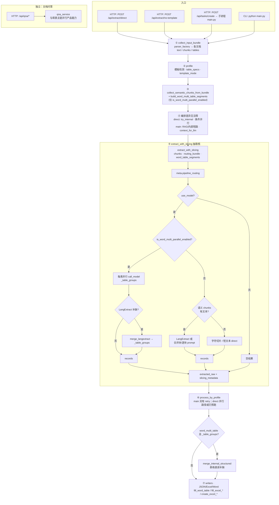
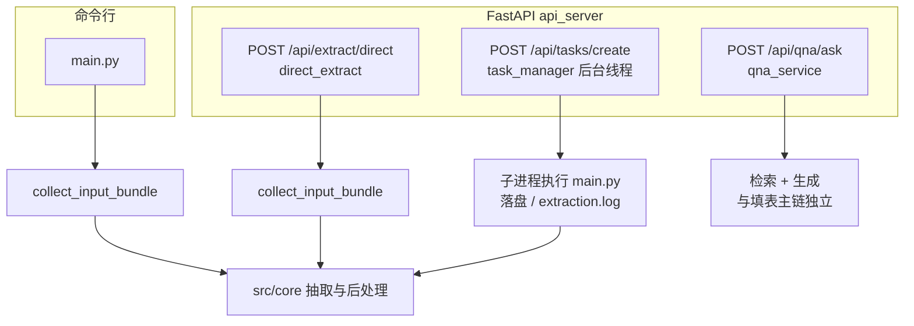
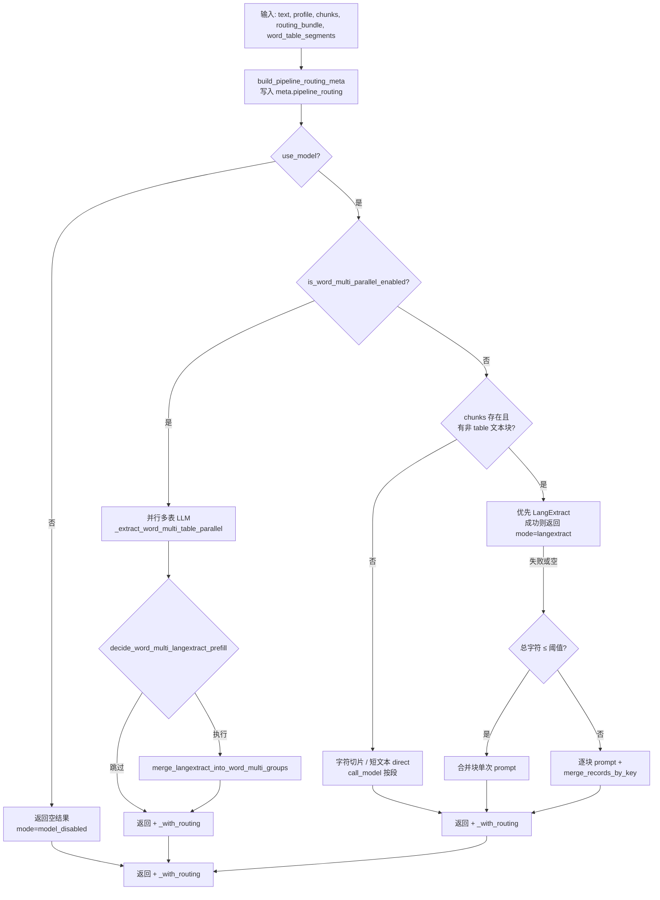
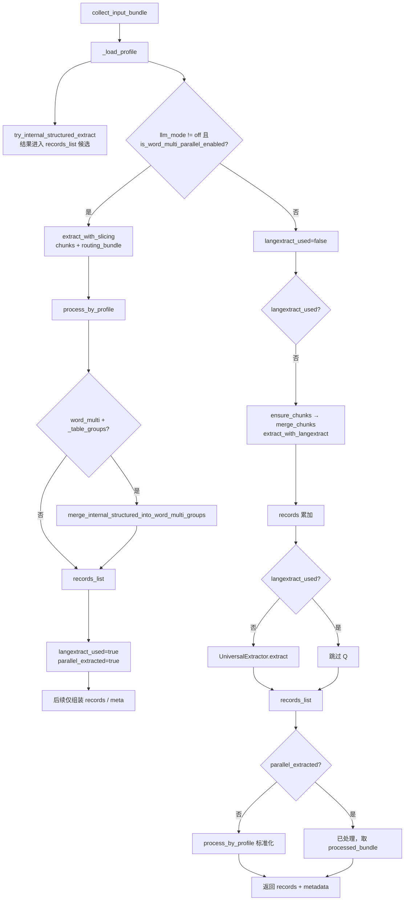
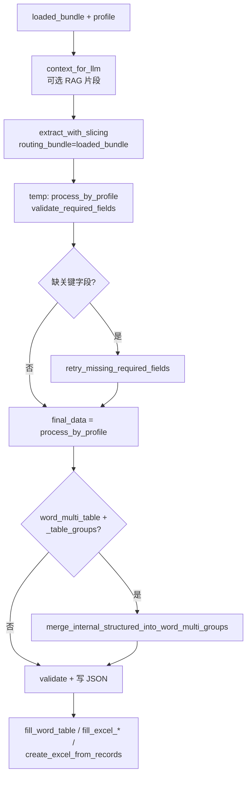

# 项目运行全流程与分支（Mermaid）

> 生产以 **HTTP API** 为主；**CLI** 与异步任务子进程共用 `src/core` 核心。  
> 元数据中的 **`pipeline_routing`** 由 `extraction_routing.build_pipeline_routing_meta` 生成，对应下图「抽取核」的静态分支摘要。

---

## 总图（全链路一张图）

下列将 **入口 → 加载 → 抽取核 → 后处理 → 写出** 连成一条主轴；`direct_extract` 与 `main.py` 的差异集中在「抽取核之前/之后的编排」，见图中注释节点。

**读图要点**

- **⑤ `extract_with_slicing`** 为 CLI / `direct_extract` 共用；**④** 在两者中具体条件不同，但总入口都是 `EW`。  
- **`direct_extract`** 在未走并行时，还会在 ⑤ 之外尝试 `ensure_chunks → LangExtract → UniversalExtractor`（总图从简，未单独画线）。  
- **`main.py`** 在 ⑥ 前后可有 **retry_missing_required_fields**、最终再次 `process_by_profile`（总图合并进 ⑥ 节点语义）。

---

## 1. 入口总览（分图）

---

## 2. 抽取核：`extract_with_slicing`（CLI 与 direct 共用）

所有路径返回的 **metadata** 均合并 **`pipeline_routing`**（输入类型、模板模式、`primary_track`、多表 LangExtract 补缺意图、`stages` 等）。

---

## 3. HTTP：`direct_extract` 编排（与 `main` 的差异）

并行多表命中时 **一次性** 完成 `extract_with_slicing → process_by_profile → merge_internal_structured`；否则走 **LangExtract → UniversalExtractor** 瀑布。

---

## 4. CLI：`main.py` 模型路径（摘要）

在 **未** 被 RAG/内部结构化短路时，使用 `context_for_llm` 调 `extract_with_slicing`，再经 **补抽重试**、**最终 process_by_profile**、**多表 internal merge**、**按模板写 Word/Excel**。

---

## 5. 后处理与填表（共用概念）

| 环节 | 模块要点 |
|------|----------|
| 记录格式化 | `process_by_profile` |
| 多表 Word 表格直读补缺 | `merge_internal_structured_into_word_multi_groups`（受 `A23_WORD_MULTI_MERGE_INTERNAL` 影响） |
| Word 多表写入 | `fill_word_table` 读 `_table_groups`，按 `table_index` 写入 |

---

## 相关代码

| 说明 | 路径 |
|------|------|
| 抽取核 | `src/core/extraction_service.py` |
| 路由摘要 | `src/core/extraction_routing.py` |
| 同步 HTTP | `src/api/direct_extractor.py` |
| 异步任务 | `src/api/task_manager.py` |
| CLI | `main.py` |

---

## 6. 导出与清理回路（后端对接）

- 任务导出确认：`POST /api/tasks/{task_id}/export-complete`
- 临时导出确认：`POST /api/download/temp/{filename}/export-complete`
- 对外 `output_files` 默认不暴露 `report_bundle`，后端侧仅消费业务产物（json/xlsx）。
